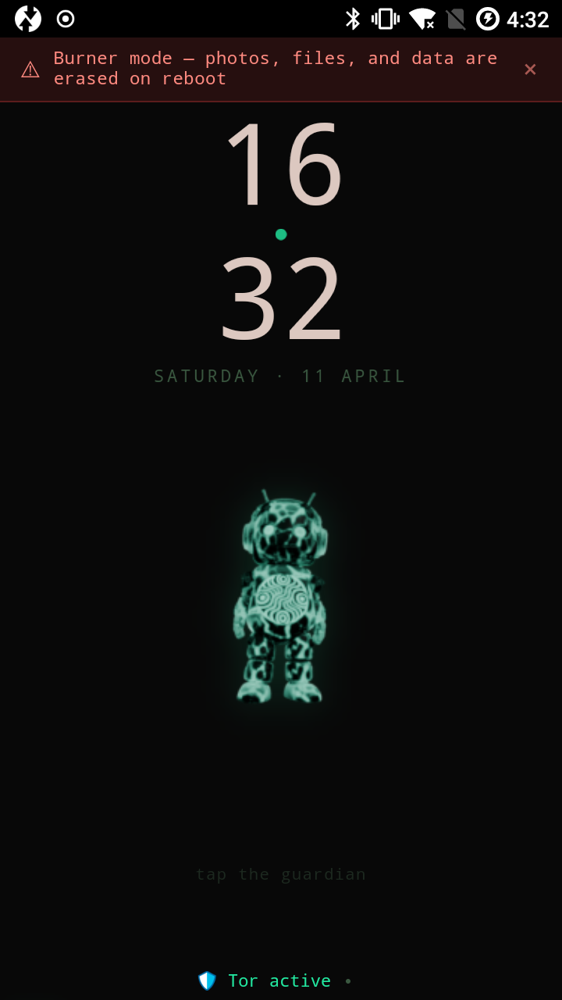
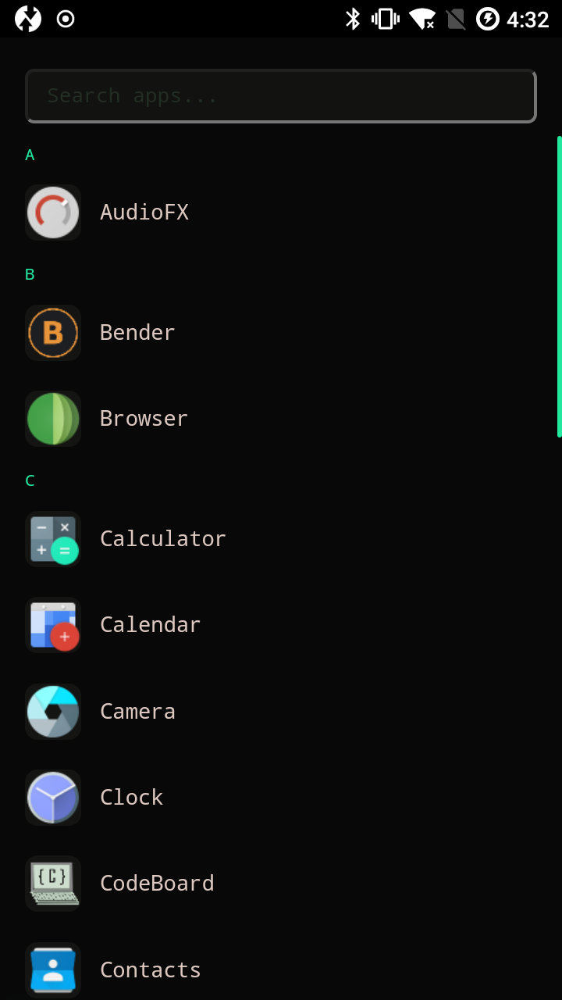

# LETHE v1.0.0 — Privacy-first Android overlay on LineageOS

**A LineageOS overlay with full Google debloat, system-level tracker blocking, hardened DNS, and Tor transparent-proxy enforcement.**

LETHE is not a ROM — it's an overlay you flash on top of LineageOS. v1.0 is R&D — testers wanted, not users yet. What lands today: build-time hardening (debloat, tracker blocking, hardened DNS, theme), Tor with iptables transparent-proxy enforcement, MAC rotation, PT bridge selection, Settings.Global runtime applicator. The headline burner-mode wipe ships in v1.1 once the architectural rework around the `system_data_file` neverallow is done. The in-OS AI guardian, Dead Man's Switch, and Void launcher are also v1.1.

---

## What's different from stock LineageOS?

| Feature | LineageOS | LETHE v1.0 |
|---------|-----------|------------|
| Trackers | Not blocked | System hosts file blocks ad/tracker domains |
| Google services | Optional | Removed at build time |
| DNS | Google/ISP | Quad9 DNS-over-TLS, Mullvad fallback — build.prop + Settings.Global |
| Tor daemon | — | Bundled, listens on `127.0.0.1:9050` (SOCKS), `:9040`, `:5400` |
| Tor enforcement | — | iptables NAT routes user-app TCP through Tor, UDP dropped |
| PT bridges | — | obfs4 / meek / webtunnel / snowflake via `persist.lethe.tor.bridge_pt` |
| MAC | Fixed | Per-connection randomization (`persist.lethe.mac_rand`) |
| Theme | LineageOS default | Teal-on-black, custom boot animation |
| Data on reboot (burner) | Persists | Service launches; full wipe needs v1.1 architectural rework |
| Android ID rotation | — | **v1.1** (bound to burner-wipe path) |
| AI guardian | — | **v1.1** |
| Panic wipe | — | **v1.1** |
| Dead man's switch | — | **v1.1** |
| Void launcher | — | **v1.1** |

---

## Supported devices

### Android 15 (LineageOS 22.1)

| Brand | Device | Codename |
|-------|--------|----------|
| Google | Pixel 7 | panther |
| Google | Pixel 7 Pro | cheetah |
| Google | Pixel 7a | lynx |
| Google | Pixel 8 | shiba |
| Google | Pixel 8 Pro | husky |
| Google | Pixel 8a | akita |
| Google | Pixel 9 | caiman |
| Google | Pixel 9 Pro | komodo |
| Google | Pixel 9 Pro Fold | tokay |
| Nothing | Phone (1) | spacewar |
| Nothing | Phone (2) | pong |
| Nothing | Phone (2a) | pacman |
| Fairphone | Fairphone 4 | FP4 |
| Fairphone | Fairphone 5 | FP5 |
| OnePlus | 8 Pro | instantnoodlep |
| OnePlus | 9 | lemonades |
| OnePlus | 9 Pro | martini |
| Xiaomi | Mi 11 Lite 4G | courbet |
| Xiaomi | Mi 11 Lite 5G | renoir |
| Motorola | Moto G7 Plus | hawao |
| Motorola | Moto G52 | devon |
| Sony | Xperia 1 II | pdx206 |
| Sony | Xperia 1 III | pdx215 |
| Samsung | Galaxy Tab S 10.5 | chagalllte |

### Android 7.1 (LineageOS 14.1, legacy)

| Brand | Device | Codename | Notes |
|-------|--------|----------|-------|
| Samsung | Galaxy Note II | t03g | Exynos 4412, in v1.0.x |
| Samsung | Galaxy Note II LTE | t0lte | Exynos 4412, **v1.0 validated** |

The other 24 codenames in the LOS 22.1 table use the same overlay pipeline but have not been individually verified for v1.0; they roll out in v1.0.x point releases.

---

## Requirements

- A supported device with LineageOS already installed
- A computer running Linux (macOS/Windows with WSL2 also work)
- A USB data cable (not charge-only)
- OSmosis installed on the computer (optional but recommended)

---

## Install instructions

### Option A: Via OSmosis (recommended)

```bash
git clone https://github.com/thdelmas/OSmosis.git ~/OSmosis
cd ~/OSmosis && make install && make serve
```

1. Plug your phone in via USB
2. OSmosis detects the device and shows compatible OS options
3. Select LETHE, click Build
4. OSmosis builds the overlay and flashes it to your phone
5. Reboot — LETHE is active

### Option B: Manual sideload

1. Install LineageOS on your device (follow the official LineageOS wiki for your device)

2. Download the LETHE overlay ZIP for your device from the GitHub releases page

3. Boot into TWRP recovery:
   - **Samsung**: Power off, hold Volume Down + Home + Power
   - **Pixel/OnePlus/Xiaomi/Motorola/Fairphone**: Power off, hold Volume Down + Power
   - **Nothing/Sony**: Power off, hold Volume Down + Power

4. In TWRP, select "Advanced" → "ADB Sideload" → swipe to start

5. On your computer:
   ```bash
   adb sideload Lethe-1.0.0-YOUR_CODENAME.zip
   ```

6. After it finishes, tap "Reboot System"

7. LETHE is now active. Tor daemon listens locally on `127.0.0.1:9050`/`:9040`/`:5400` and the iptables NAT routes user-app TCP through it. Burner-mode full wipe is still v1.1 work — see "Coming in v1.1" below.

---

## AI guardian (v1.1)

The in-OS AI guardian — a system-service agent that lives in the OS rather than as a separate app — is coming in v1.1. v1.0 ships the foundation; v1.1 adds the agent (cloud LLMs via your API key, with on-device models targeted for capable hardware) and the Void launcher (clock + mascot + gesture-driven home screen).

When v1.1 ships, the agent's API key will live in /persist (survives the burner-mode wipe so you don't have to re-pair every reboot).

---

## What's included in v1.0

- **Tracker blocking** — system-level hosts file (StevenBlack + AdAway) intercepting ad/tracker domains for every app.
- **Hardened DNS** — Quad9 DNS-over-TLS primary, Mullvad fallback in build.prop, plus `lethe-apply-settings` pushes equivalent keys into Settings.Global at first boot.
- **Full Google debloat** — Play Services, Play Store, GSF, Maps, YouTube, Setup Wizard removed at build time. F-Droid + Aurora Store ship instead.
- **Tor — daemon + transparent proxy** — bundled, running under enforcing SELinux in its own `tor` domain. Listens on `127.0.0.1:9050` (SOCKS), `:9040` (TransPort), `:5400` (DNSPort). iptables NAT redirects user-app TCP (UIDs 10000–99999) into the TransPort and drops non-DNS UDP.
- **PT bridge selection** — `persist.lethe.tor.bridge_pt` (one of `none|obfs4|meek|webtunnel|snowflake`) chooses the pluggable transport. One setprop + reboot to switch.
- **MAC rotation** — `lethe-mac-rotate` re-randomizes the WLAN MAC per connection when `persist.lethe.mac_rand` is enabled.
- **LETHE theme** — teal-on-black, custom boot animation, dark wallpaper.
- **Privacy sensor defaults** — background location, body sensors, nearby-devices denied by default for all apps.

## Coming in v1.1

- **Full burner-mode wipe** — the `lethe-burner-wipe` service launches in v1.0 and clears app-writable paths, but cm-14.1's `system_data_file` neverallow (`domain.te:495`) reserves writes under `/data/system` to init / installd / system_server / system_app with no extension hook for a custom domain. A clean every-reboot wipe needs an architectural rework — likely triggering Android's factory-reset path through recovery.
- **Android ID rotation** — currently bound to the burner-wipe path; lands when full wipe lands.
- **LETHE agent** — in-OS AI guardian with tool calling, provider-agnostic (bring your own key), on-device models for capable hardware.
- **Void launcher** — minimalist clock + mascot home screen with gesture navigation.
- **Dead man's switch** — missed-check-in escalation chain (lock → wipe → optional brick) with duress PIN and hint-based recovery.
- **Panic wipe** — 5× power-button press = instant wipe. Same `system_data_file` constraint as full burner wipe; ships with it.
- **Mesh signaling preview** — short-range BLE heartbeat between trust-ring devices as DMS transport (chat lives in Briar/Molly, not the mesh).
- **IPFS OTA** — Tor-routed, Ed25519-signed firmware updates.
- **Tor uid drop** — `lethe-tor` runs as root in v1.0; v1.1 moves it to uid 9050 with proper privilege drop.
- **ADB hardening** — paired-host RSA whitelisting, ADB-over-USB only by default. (`ro.adb.secure=1` is already on.)
- **Anthropic OAuth** — use your claude.ai subscription as the agent backend.

## Not yet planned

- WiFi QR code scanner
- Per-app sensor permissions UI
- Verified boot (AVB relock for Pixels)

---

## Screenshots

| Home screen | App drawer |
|:-----------:|:----------:|
|  |  |

*Galaxy Note II (t0lte) — Android 7.1*

The Void launcher and agent chat screenshots will be added when v1.1 ships those features.

---

## Legal

Check your local laws regarding encryption and privacy software before installing. Some countries restrict or ban Tor, VPNs, encryption tools, or AI systems. Full legal disclaimers: [PRIVACY.md](https://github.com/thdelmas/lethe/blob/main/PRIVACY.md)

---

## Source code

- **LETHE overlay:** [github.com/thdelmas/lethe](https://github.com/thdelmas/lethe)
- **OSmosis (installer):** [github.com/thdelmas/OSmosis](https://github.com/thdelmas/OSmosis)

## Community

- **Discord (LETHE):** https://discord.gg/tAqyY47Szp
- **Discord (OSmosis):** https://discord.gg/vWqxwvRpJe

---

## FAQ

**Q: Will this brick my phone?**
A: No. LETHE is an overlay on LineageOS — you can always re-flash stock LineageOS to remove it.

**Q: Does v1.0 actually wipe data on reboot?**
A: Partially. `lethe-burner-wipe` launches and clears app-writable paths under `/data/data` and `/data/user`, but cm-14.1's `system_data_file` neverallow blocks any custom SELinux domain from writing under `/data/system` — so a clean sweep needs an architectural rework. v1.1 will trigger Android's factory-reset path via recovery instead of a userspace `rm`. v1.0's Tor enforcement and tracker blocking are fully active.

**Q: When does the AI guardian ship?**
A: v1.1. v1.0 is the foundation it'll run on (system service slot, agent settings UI, EU AI Act consent flow). When v1.1 ships, it'll route to a cloud LLM via your API key, with on-device models for capable hardware.

**Q: Why not just use GrapheneOS?**
A: Different goals. GrapheneOS is deeper security on Pixels only. LETHE is operational security (burner mode, identity rotation, hardened DNS, tracker blocking) on 26 device codenames across 8 brands.

**Q: My old phone from 2012 — will it work?**
A: If it runs LineageOS, probably yes. The Galaxy Note II (2012) is a tested device.
